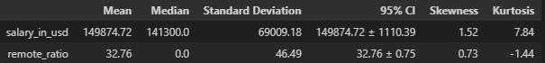
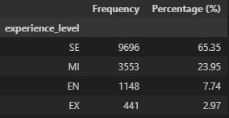
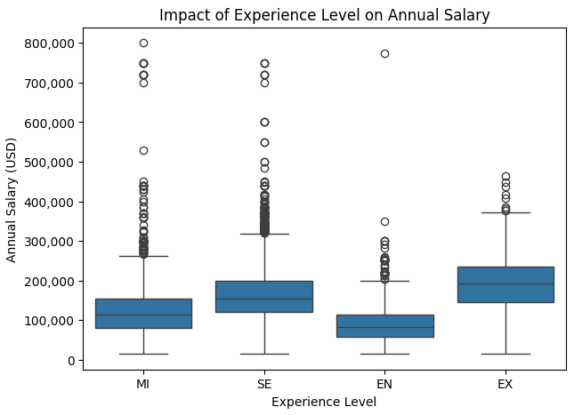
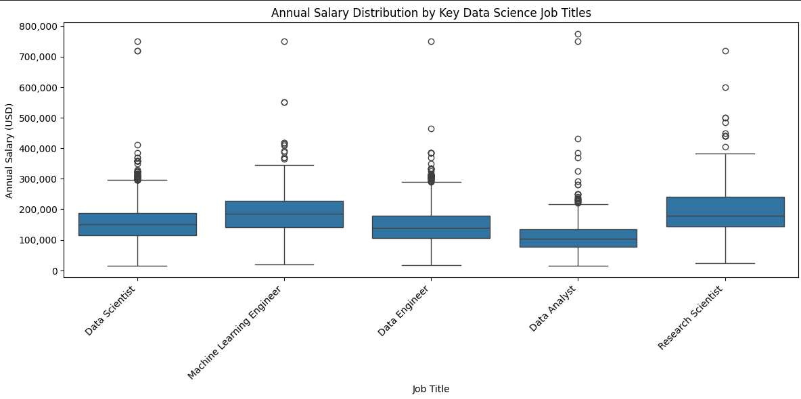
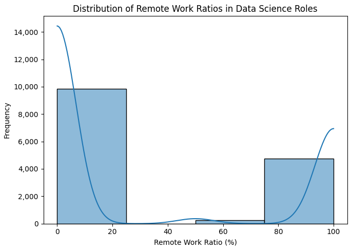
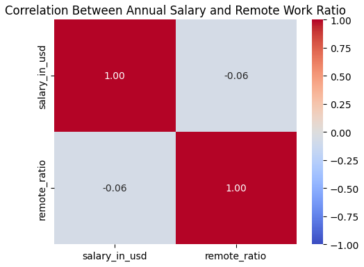
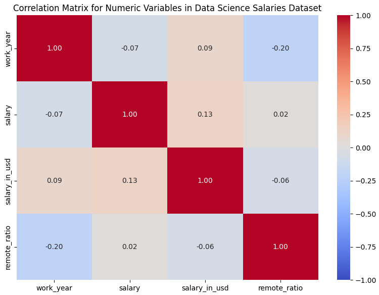

# Data Exploration
---
## High Level Overview 
---

1. **Import Libraries**  
   - **Action**: Import the following libraries:  
     - `pandas`  
     - `numpy`  
     - `matplotlib.pyplot`  
     - `seaborn`  
     - `os`  

2. **Load Data**  
   - **Action**: Load the `Data_Science_Salaries.csv` file into a pandas DataFrame.  
   - **Code Example**:  
     ```python
     data = pd.read_csv('Data_Science_Salaries.csv')
     ```  
   - **Function Used**: `pd.read_csv()`  

3. **Continuous Variables Analysis**  
   - **Action**: Calculate summary statistics for `salary_in_usd` and `remote_ratio`.  
   - **Metrics Calculated**:  
     - **Kurtosis**: `.kurt()`  
     - **Skewness**: `.skew()`  
     - **Summary Statistics**: `.describe().T`  
     - **Median**: `.median()`  
   - **Additional Metric**: `Confidence Interval (95%)`  

4. **Categorical Variables Analysis**  
   - **Action**: Analyze frequency of categorical variables such as:  
     - `experience_level`  
     - `employment_type`  
     - `job_title`  
     - `company_size`  
     - `company_location`  
   - **Outputs**: Frequency and percentage breakdown in `categorical_summary`.  

5. **Boxplot: Experience vs. Salary**  
   - **Action**: Create a boxplot to visualize experience level against annual salary in USD.  
   - **Library Used**: `seaborn`  
   - **Function Used**: `sns.boxplot()`  

6. **Filter Job Titles and Boxplot: Job Titles vs. Salary**  
   - **Action**: Focus on key job titles  
     - Data Scientist  
     - Machine Learning Engineer  
     - Data Engineer  
     - Data Analyst  
     - Research Scientist  
   - **Visualization**: Create a boxplot for job title vs salary using `sns.boxplot()`  

7. **Histogram: Remote Ratio**  
   - **Action**: Create a histogram to show the distribution of remote work ratios in data science roles  
   - **Library Used**: `seaborn`  
   - **Function Used**: `sns.histplot()`  

8. **Heatmap: Salary vs. Remote Ratio**  
   - **Action**: Visualize the correlation between salary and remote ratio using a heatmap  
   - **Library Used**: `seaborn`  
   - **Function Used**: `sns.heatmap()`  

9. **Heatmap: Numeric Correlations**  
   - **Action**: Create a heatmap for the correlation matrix of numerical variables  
   - **Library Used**: `seaborn`  
   - **Function Used**: `sns.heatmap()`

## Recap Background & Question
--- 
### Research Question
How do key factors such as experience level, job title, company size, remote work ratio, and geographic location affect salaries in the data science field?

### Hypothesis
Hypothesize that experience level and job title will be the most significant predictors of salary, with senior roles earning more than junior roles.

### Prediction
Predict that remote work, larger company size, and location will correlate with higher salaries.

---
## Methods

The dataset, `Data_Science_Salaries.csv`, contains approximately 15,000 entries detailing factors that impact salaries in data science roles, including experience level, job title, employment type, salary, remote work ratio, employee residence, and company size. The data was provided in csv format, allowing for easy loading and manipulation in Python. Since the dataset was complete and did not require scraping or merging, I was able to move directly into preprocessing and analysis. All salary data is standardized in USD for consistent comparisons across different locations.

For EDA, I began with data cleaning and preprocessing. This included checking for missing values, duplicates, and standardizing salary values to USD. Since the dataset was well organized, I proceeded directly to analyze distributions and relationships among key variables. Categorical variables were converted to numerical format using one hot encoding to prepare for further statistical analysis and modeling.

The analysis focused on identifying patterns using visualizations and summary statistics. I used boxplots and histograms to examine salary distributions by experience level, job title, and company size, as these charts show averages and variation. Correlation analysis, including scatter plots and a correlation heatmap, helped me understand relationships between continuous variables like remote work ratio and salary. This EDA allowed me to spot trends and outliers, guiding my analyses and improving my approach to predictive modeling.

---

## Results (Tables, Visualizations, and Brief Interpretations)

### Table 1 - Continuous Statistics



**Context:** This table provides summary statistics for salary_in_usd and remote_ratio.  

**Interpretation:**
- **Salary:** The mean salary of around $150,000 is higher than the median, indicating some high-paying roles are raising the average. The positive skew and high kurtosis suggest a right-skewed distribution with a few outliers.
- **Remote Ratio:** The mean remote ratio is 32.76%, but with a median of 0%, showing most roles are fully on-site, with a smaller section being remote or hybrid. Negative kurtosis suggests a flatter distribution, with fewer extreme values compared to the mean.

### Table 2 - Experience Level Summary



**Context:** This table shows the frequency and percentage distribution for experience_level, summarizing workforce breakdown by level.  

**Interpretation:** A majority of the roles are at senior and mid-level, indicating that the dataset mainly includes experienced professionals. The smaller representation of entry level and executive roles implies fewer opportunities for new or executive level hires.

---

## Graphs

### Figure 1 - Impact of Experience Level on Annual Salary




**Context:** This boxplot displays salary distribution across experience levels.  

**Interpretation:** Median salaries increase with experience, with executive level roles showing the highest median. Salary ranges expand at higher experience levels, showing greater variability in salary as experience increases. Outliers at the mid and senior levels indicate that some roles or companies provide exceptionally high salaries compared to the average range.

---

### Figure 2 - Annual Salary Distribution of Key Data Science Job Titles



**Context:** This boxplot displays salary differences for roles like Data Scientist, Machine Learning Engineer, Data Engineer, Data Analyst, and Research Scientist.

**Interpretation:** Among these roles, Machine Learning Engineers and Research Scientists show higher median salaries compared to the rest, indicating the strong demand and expertise for a specialized skill set. The presence of outliers in each role suggests that specific high paying positions may exist within each job category, but the range of salaries vary.

---

### Figure 3 - Distribution of Remote Work Ratios in Data Science Roles



**Context:** This histogram shows the distribution of remote work ratios, ranging from on-site to fully remote.

**Interpretation:** Most roles are on-site or fully remote, as seen by peaks at 0-20% and 80-100%. The distribution reflects a trend in remote work arrangements, with fewer hybrid roles. This pattern reveals that many companies either fully support or limit remote work options.

---

### Figure 4 - Correlation Between Annual Salary and Remote work Ratio



**Context:** This heatmap shows the correlation between salary_in_usd and remote_ratio.  

**Interpretation:** The weak or near zero correlation indicates that remote work ratio does not strongly influence salary, suggesting remote work flexibility is not a key factor in determining salary.

---

### Figure 5 - Correlation Matrix for Numeric Variables in Data Science Salaries Dataset



**Context:** This heatmap presents the correlation matrix for numeric variables in the dataset, including work_year, salary, salary_in_usd, and remote_ratio.  

**Interpretation:** The correlation matrix reveals weak relationships between the numeric variables. There is a slight negative correlation between work_year and remote_ratio, suggesting that in more recent years, there might be less of a reason for remote work; however, this relationship is weak.

---

## Discussion & Next Steps

### Discussion

The exploratory analysis revealed several insights into salary trends within data science roles. The key finding is that experience level influences salary, with higher experience levels associated with a broad salary range and higher median pay (see Figure 1). Specific job titles, such as Machine Learning Engineer and Research Scientist, earn higher salaries than other roles due to having a specialized skill set (see Figure 2). However, the remote work ratio does not appear to strongly impact salary, as shown by the near zero correlation (Figure 4). This implies that while some positions offer remote flexibility, it is not a primary factor for determining salary.

These findings address the research question: How do key factors such as experience level, job title, company size, remote work ratio, and geographic location affect salaries in the data science field? Experience level and job title emerged as significant factors, while remote work flexibility appears less influential, suggesting higher paying roles may be more closely associated with experience and a specialized skill set.

---

### Next Steps

For the next steps, I will focus on data cleaning and preparation for modeling. This will include converting categorical variables into dummy variables for quantitative analysis. I will address any missing values and review outliers to decide if they should be removed or kept to avoid skewing results.

I will also consider normalizing or standardizing continuous variables like salary_in_usd to reduce the impact of extreme values. Additionally, feature engineering will help create variables that better represent aspects of experience, such as years in the field, improving the model's performance in predicting salaries. These steps will improve the dataset for further analysis, allowing me to address the research question in more detail.

---
