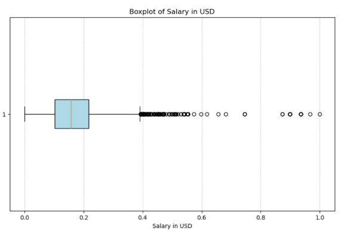
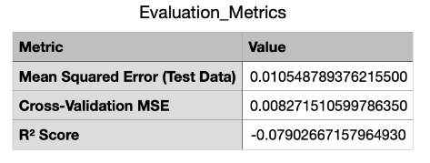
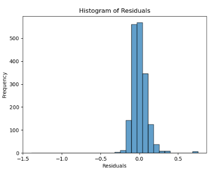
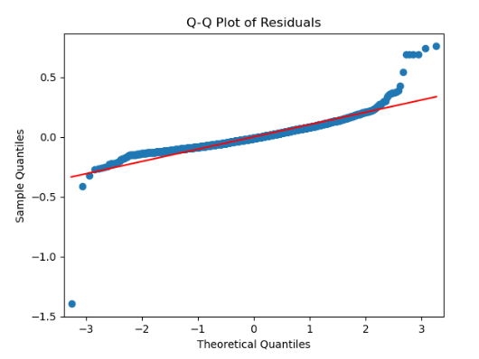
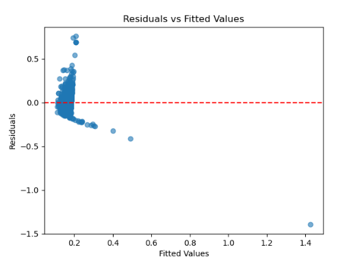

# Model Selection and Development
---
## High Level Overview
---
#### 1. Library Imports
- Imported necessary libraries for:
  - Data manipulation
  - Feature scaling
  - Data visualization

#### 2. Data Preparation
- Loaded the dataset: `Data_Science_Salaries.csv`
- Removed duplicates to ensure data integrity
- Identified outliers using Interquartile Range (IQR) method
- Normalized continuous features (e.g., salary, remote ratio) using Min-Max Scaling (0–1 range)

#### 3. Feature Engineering
- Created new combined feature: `experience_job_combination`
  - Captures interaction between `experience_level` and `job_title`
- One-hot encoded categorical variables for model compatibility

#### 4. Dataset Splitting
- Separated features (X) and target variable (y)
- Split data into training and test sets with an 80/20 ratio

### Dimensionality Reduction

#### 1. PCA Transformation
- Applied Principal Component Analysis (PCA) to training data
- Retained 2 principal components
- Visualized PCA-transformed data using scatter plots

#### 2. Explained Variance
- Reported variance captured by each principal component
- PCA found to contribute minimally to overall data structure

### Initial Model: Linear Regression

#### 1. Model Training
- Initialized and trained a Linear Regression model
- Applied cross-validation for performance evaluation

#### 2. Model Evaluation
- Assessed performance using:
  - Mean Squared Error (MSE) on test data
  - Cross-Validation MSE
  - R² Score

#### 3. Residual Analysis
- Conducted residual diagnostics using:
  - Residuals vs Fitted Values scatter plot
  - Q-Q Plot (normality check)
  - Histogram of Residuals (distribution shape)

## Background & Question
---

**Research Question:** How do experience level, job title, company size, remote work ratio, and geographic location influence salary trends in the data science field?

**Hypothesis:** Hypothesize that experience level and job title are expected to be the most significant predictors of salary in data science, with company size, remote work flexibility, and geographic location playing secondary roles.

**Prediction:** Predict that higher salaries will correlate with advanced experience levels, specialized job roles, remote work options, larger company size, and certain geographic locations.

## Methods
---
The preprocessing plan focused on handling missing values, removing duplicates, and standardizing salary data to USD for consistent comparisons. Based on the EDA findings, identified and kept salary outliers to analyze high paying roles while normalizing continuous variables like salary and remote ratio to limit extreme values. For feature engineering, introduced a combined feature, experience job combination, to capture the interaction between experience level and job title, as these were found to be key predictors of salary trends. The initial modeling approach included using one hot encoding for categorical variables and standardizing features to guarantee compatibility with machine learning models.

## Pre-processing
---
To prepare the dataset for analysis, began by checking for missing values and duplicates. While no missing values were found, duplicates were removed to guarantee data integrity and prevent bias in statistical measures and machine learning models. Outliers in salary data, identified using IQR analysis, were kept because they represent high paying roles that are vital to answering the research question. These outliers provide valuable insights into the salary trends I want to analyze. To address the potential impact of outliers on modeling, normalized continuous variables, such as salary and remote work ratio, using MinMaxScaler, scaling their values between 0 and 1 to confirm all features contributed equally to model performance. Categorical variables, such as experience level and job title, were one hot encoded to make them compatible with machine learning algorithms. Applied the drop first option during encoding to minimize duplication and address multicollinearity. Additionally, a new feature, experience job combination, was created by combining experience level and job title. This decision was based on findings from the EDA, which showed that these factors strongly influence salary. Continuous variables were further standardized using StandardScaler to center them at 0 and scale their variance to 1, providing consistency for models that depend on feature scaling. These preprocessing choices are supported by visualizations such as boxplots, which highlight key data trends, allowing us to create a clean, interpretable dataset optimized for modeling.

### Figure 1: Boxplot of Salary in USD

This boxplot shows the distribution of salaries, including outliers kept for analysis to confirm that high paying roles are represented in the dataset.

## Feature Selection
---
For feature engineering, focused on creating a new interaction feature, experience job combination, which combines experience level and job title. This decision was made by the EDA findings, which revealed that both experience level and job title are significant predictors of salary. By combining these variables, I worked to capture their interaction effects, potentially revealing new patterns in salary trends. Additionally, categorical variables, such as experience level, job title, and the newly created feature, were one hot encoded to maintain compatibility with machine learning algorithms. To reduce redundancy and prevent multicollinearity, used the drop first option during encoding.

Unsupervised methods like PCA were evaluated for feature selection and reducing feature dimensions. PCA was performed on the scaled dataset using StandardScaler to standardize features, guaranteeing they had a mean of 0 and variance of 1. However, the first two principal components explained less than 1% of the total variance, showing that PCA did not effectively capture the dataset's variability. The scatter plot of PCA components showed limited separation among data points, suggesting minimal benefit for reducing feature dimensions. Given these results, excluded PCA from further analysis, keeping the original features as they maintained the dataset’s variability and consistency with the research goals. This decision highlights the importance of prioritizing meaningful features over reducing feature dimensions in the dataset.

### Figure 2: PCA Scatter Plot

The scatter plot of the first two principal components shows limited separation among data points, supporting the exclusion of PCA for reducing the number of features.

## Initial Model
---
For the initial model, selected linear regression because it is simple, interpretable, and effective for understanding the relationships between predictors and the target variable, salary. Linear regression serves as a strong baseline model, providing a starting point for evaluating feature importance and model performance. This decision was made by insights from the EDA, which revealed linear trends between predictors like experience level and salary. Additionally, the model's ability to clearly measure the impact of each feature through its coefficients makes it valuable for understanding and interpreting the data.

To train the model, I performed a train test split with an 80/20 ratio to evaluate the model on new data while keeping enough data for training. Used 5-fold cross validation to check the model’s performance and reduce the chance of overfitting. Before training, the data was standardized using StandardScaler to put all predictors on the same scale, which is important for the model's accuracy. Tested key assumptions of linear regression, including linearity, equal variance of errors, and normality of residuals. Residual plots showed no major issues with linearity or equal variance, and a Q-Q plot confirmed that residuals were roughly normally distributed. These steps confirmed linear regression was a good starting model for the analysis.

## Results (Tables, Visualizations, and Brief Interpretations)
---
### Pre-processing & Feature Engineering

During preprocessing, began by addressing duplicates to maintain data integrity and avoid repeating specific data points. Outliers in salary data, identified using the IQR method, were kept because they represent high paying roles vital to the research question. A total of 166 outliers were identified and kept in the dataset. Continuous variables such as salary in usd and remote ratio were normalized using MinMaxScaler, scaling their values to a range of 0–1, which provided consistency and reduced the impact of extreme values during modeling. A box plot visualization (Figure 1) shows the salary distribution, including these outliers. These preprocessing steps helped create a clean, standardized dataset made for feature engineering and modeling.

### Initial Model

#### Linear Regression
Linear Regression was chosen as the initial model due to its simplicity, interpretability, and ability to capture linear relationships between predictors and the target variable, salary. The model's performance is evaluated using the metrics summarized in Table 1. The Mean Squared Error on test data shows the average squared difference between actual and predicted values, while the Cross-Validation MSE checks the model's stability across multiple folds, reducing the risk of overfitting. However, the negative R2 Score shows that the model fails to explain the variance in salary better than a mean predictor, pointing to potential issues in capturing the complexity of the dataset. These results focus on the need to explore additional features or alternative algorithms to improve predictive performance.

### Table 1: Evaluation Metrics

This table summarizes the key performance metrics of the initial linear regression model, focusing on the Mean Squared Error, Cross-Validation MSE, and R2 Score.

### Assumptions

Checked the assumptions of the linear regression model by using several diagnostic plots. The Histogram of Residuals shows that the residuals are approximately normally distributed, which supports the assumption of normality. The Q-Q Plot of Residuals further confirms this, with points lying close to the diagonal line, showing that the residuals follow a normal distribution. The Residuals vs Fitted Values Plot shows that the variance of residuals remains roughly constant across all fitted values, confirming the assumption of homoscedasticity. These diagnostic checks confirm that the assumptions of linear regression are met, but further changes to the model may be needed based on the R2 score and other metrics.

### Figure 3: Histogram of Residuals

This histogram shows the distribution of residuals, demonstrating that they are normally distributed, supporting the assumption of normality in the linear regression model.

### Figure 4: Q-Q Plot of Residuals

The Q-Q plot of residuals shows that the points lie close to the diagonal line, confirming that the residuals follow a normal distribution.

### Figure 5: Residuals vs Fitted Values Plot

The residuals vs fitted values plot shows that the variance of residuals remains constant across all fitted values, confirming the assumption of homoscedasticity in the linear regression model.

## Overfitting
---
To control for overfitting in the initial model, used several techniques. I validated the model by splitting the data into training and testing sets, using an 80/20 ratio, to make sure that the model's performance was evaluated on new data. Additionally, used 5-fold cross validation to check the model's stability across different subsets of the training data, helping to lower the risk of overfitting. While regularization was not applied initially, it could be considered in future models to avoid making the model too complex. Finally, performed feature selection by one hot encoding categorical variables and standardizing continuous variables, making sure that only relevant features were used to train the model. These steps helped improve the model’s ability to generalize and reduce overfitting.

## Discussion & Next Steps
---
### Discussion

The preprocessing and feature selection steps played a critical role in preparing the dataset for modeling. Focused on maintaining data quality by handling missing values, removing duplicates, and normalizing continuous variables like salary and remote ratio using MinMaxScaler. This provided consistency across features, reducing the impact of extreme values during modeling. Additionally, kept outliers in the salary data, as they represent high paying roles that are essential for answering the research question. Through feature engineering, created the experience job combination feature, which captures the interaction between experience level and job title, two key predictors identified in the EDA. Categorical variables were one hot encoded, allowing the model to work with them effectively. These preprocessing choices were verified through residual plots, confirming that the model assumptions were met.

In terms of the initial model, chose linear regression due to its simplicity and interpretability. The linear regression model provided a baseline for understanding the relationship between the predictors and the target variable. The performance metrics, including MSE and R2, provided insight into the model's ability to explain salary variance. While the negative R2 score shows that the model is not capturing all the complexities of the dataset, it served as a good starting point. This aligns with the research question about identifying factors that influence salaries in data science, but the results show that the model needs improvement. Based on these findings, may consider adding more features, testing nonlinear models, or applying regularization techniques to improve the model's performance.

### Next Steps: Model Selection & Tuning Plan

For the next steps, My plan to test additional models to improve the prediction of salaries in data science roles. First, will try more complex models such as Decision Trees, Random Forests, and Gradient Boosting Machines, which can identify nonlinear relationships between features and target variables. These models will be assessed using a holdout test set and cross validation to evaluate their stability and performance. I will also look into the use of regularization techniques, such as Lasso or Ridge regression, to avoid overfitting by reducing large coefficients and promoting more generalizable models.

In terms of hyperparameter tuning, I will perform grid search or random search on key parameters like tree depth, learning rate, and number of estimators for models like Random Forests and Gradient Boosting. Additionally, I will fine tune the regularization strength for Ridge and Lasso regression. The analysis from the initial linear regression model highlighted the importance of testing more complex models, which could better capture the patterns in the dataset. Based on this, the analysis plan will be adjusted to include these additional models and tuning strategies to improve the model's predictive power.
