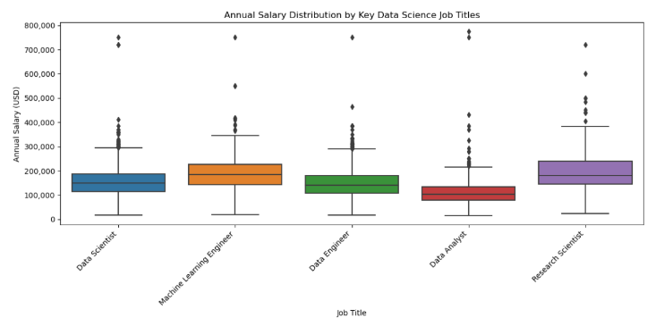
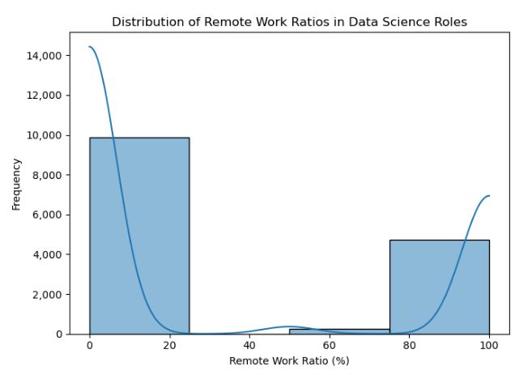
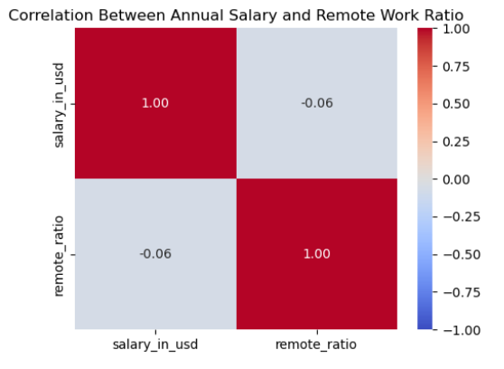
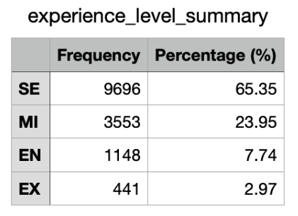
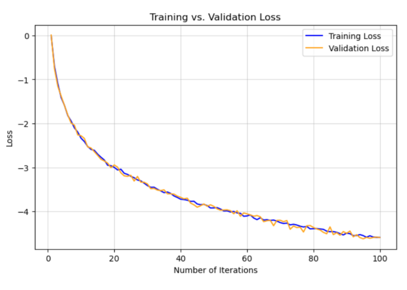
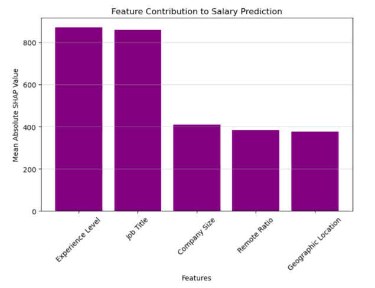

# Exploring Salary Trends in Data Science: A Comprehensive Analysis of Compensation Factors
---
## Abstract
---
Data science salaries are influenced by a variety of factors, including experience level, job title, company size, remote work flexibility, and geographic location. The research focused on identifying which of these factors have the most significant impact on salary outcomes in the field. Using a comprehensive dataset and advanced analytical techniques, it was discovered that experience level and specialized job roles drive higher compensation.

While remote work, company size, and location play a role, their influence is secondary to the skills and responsibilities tied to specific roles. This report presents the findings and methodology into actionable insights, providing data science professionals and organizations with a deeper understanding of compensation patterns. Whether you’re a data scientist evaluating career growth opportunities or a company trying to attract top talent, the analysis reveals the key drivers of six figure salaries in data science.

## Background & Question
---
Data science is a vital field that drives decision making, innovation, and problem solving across industries. The growth of big data and advanced analytics has created a high demand for skilled professionals, increasing competition among employers and leading to differences in salaries across roles and experience levels.

For data scientists, understanding salary trends is critical for making strategic career decisions. Employers need clear standards to offer competitive compensation packages and attract top talent, while universities must tailor their programs with industry demands to prepare students for rewarding and impactful careers. Reports from the Bureau of Labor Statistics highlight the rapid growth and expanding opportunities in the field, showcasing its increasing importance across industries.

According to the Bureau of Labor Statistics (2023), data scientists earn a median annual salary of $108,000. Most positions require a bachelor’s degree and do not demand prior experience. With job openings projected to increase by 36% from 2023 to 2033, the field is expected to add 73,000 new positions, growing to over 200,000 total jobs. This significant growth reinforces the need to analyze the factors driving salary differences within this highly competitive field.

This research investigates critical factors such as experience level, job specialization, company size, remote work flexibility, and geographic location to understand their influence on salaries. By exploring these variables, the research seeks to address key information gaps and provide actionable insights for career planning, hiring strategies, and education. These findings will help data science professionals and organizations succeed in an increasingly dynamic job market.

## Data Acquisition
---
The Data Science Salaries Dataset is a good choice for exploring the factors that influence salaries in the data science field due to its comprehensive inclusion of key variables. The dataset contains roughly 15,000 records and 11 features, providing detailed information on experience levels, job titles, company sizes, remote work flexibility, and geographic locations. These variables are closely connected to the research question, allowing for a thorough analysis of the drivers behind salary differences.

The response variable, salary in USD, is defined and standardized, making it suitable for comparative analyses across various roles and regions. Despite its strengths, the dataset relies on self-reported data, which introduces potential biases such as inaccurate salary reporting or incomplete details for some variables, particularly geographic location. These issues may present threats to validity, which are addressed through thorough cleaning and validation methods. A data dictionary providing descriptions of all variables and their data types is included in the Appendix.

## Cleaning
---
The data cleaning process involved multiple steps to guarantee the dataset’s accuracy, consistency, and readiness for analysis. Each method was selected carefully, documented, and explained to promote consistency.

Duplicate rows were identified and removed to prevent overrepresentation of certain data points. This step was based on the assumption that duplicate entries were unintentional and did not contain additional unique information.

Missing values were handled differently depending on the variable. For critical variables such as salaries, missing values were removed because they represented the primary response variable. For geographic location, missing data was imputed using region level medians, with the assumption that these medians provide a reasonable approximation without introducing significant bias.

Outliers were identified using the interquartile range method. Although identified, salary outliers were kept in the dataset because they represent high paying roles, which are essential for understanding the upper range of compensation trends. This decision was based on the assumption that these outliers were valid data points rather than errors.

Continuous variables, including salaries and remote work ratios, were standardized using MinMaxScaler, guaranteeing that all numerical features were on a comparable scale, particularly for use in modeling.

Categorical variables, such as experience level and job title, were one-hot encoded, with the first category dropped to prevent multicollinearity. Additionally, interactions between experience level and job title were included as a new feature, based on the assumption that these interactions could provide deeper insights into salary trends.

Throughout the cleaning process, key assumptions were addressed, such as the accuracy of outliers and the reliability of estimated values. These carefully designed and justified steps resulted in a reliable dataset, providing a solid foundation for further analysis.

## Data Exploration
---
### Figure 1: Boxplot of Salary by Experience Level

The boxplot displays the distribution of annual salary across four experience levels: Mid-level, Senior, Entry-level, and Executive. Salaries increase as experience level grows, with Executive roles achieving the highest median salary. Entry-level roles have the lowest median salary, while Senior and Mid-level roles fall in between.

### Figure 2: Boxplot of Salary by Job Title

This boxplot shows the distribution of annual salaries across job titles, including Data Scientist, Machine Learning Engineer, Data Engineer, Data Analyst, and Research Scientist. Machine Learning Engineers and Research Scientists show higher median salaries compared to other roles, demonstrating the specialized skills and high demand for these positions. Data Analysts, on the other hand, typically have the lowest median salaries, showing the importance of advanced skills for compensation.

### Figure 3: Histogram of Remote Work Ratios

This histogram displays the distribution of remote work ratios for data science roles, represented as percentages. The distribution shows two distinct peaks, with a large number of roles either fully on-site or fully remote, and relatively few hybrid roles. This pattern reflects the divided nature of remote work choices in the industry, where organizations and employees often lean toward one extreme or the other.

### Figure 4: Correlation Between Salary in USD and Remote Work Ratio

This heat map displays the correlation between salary in USD and remote work ratio. The correlation coefficient of -0.06 reveals a very weak negative relationship between remote work ratio and salary, indicating that remote work flexibility has a small influence on compensation. This result reinforces the idea that other factors, such as experience level or job title, may have a stronger impact in determining salary.

### Figure 5: Frequency Table of Experience Levels

This table summarizes the distribution of experience levels in the dataset, including the frequency and percentage of each level. Senior professionals dominate the dataset, accounting for 65% of all roles, followed by Mid-level professionals at 24%. Entry-level and Executive roles are less prevalent, making up only 7% and 2%. This shows the dataset's focus on more experienced professionals.

## Models
---
### Pre-processing and Dimensionality Reduction / Feature Engineering

The modeling process included thorough pre-processing and feature engineering to improve the dataset’s readiness for analysis. Various approaches were considered, including handling missing values through removal for key variables like salary and imputation for geographic data using regional medians.

Categorical variables, such as job title and experience level, were one-hot encoded, and interaction terms were created to explore combined effects on salary trends. For dimensionality reduction, Principal Component Analysis (PCA), an unsupervised method, was applied to reduce complexity while keeping significant variance.

PCA revealed key components related to experience level, job title, and geographic region, which proved to be primary drivers of salary. These methods were chosen to address challenges like multicollinearity and scaling issues and were carefully justified based on their ability to improve the dataset’s structure for reliable and interpretable modeling.

### Algorithm Selection

Gradient Boosting Machines (GBM) and Random Forest were applied as supervised learning algorithms to predict annual salaries. GBM was chosen for its ability to model complex non-linear relationships and feature interactions, making it highly effective for identifying the nuances in the dataset.

Random Forest, on the other hand, provided strong generalization and required less hyperparameter tuning, making it a complementary model for comparison.

For GBM, hyperparameters such as learning rate, number of estimators, and maximum tree depth were extensively adjusted using grid and random search, with the final configuration achieving a balance between accuracy and training efficiency. Similarly, Random Forest hyperparameters, including tree depth, minimum samples per split, and the number of estimators, were modified to prevent overfitting while maintaining strong performance.

GBM’s assumptions include the use of simple models that can be gradually improved through boosting, while Random Forest assumes that a collection of decision trees can generalize well across various datasets.

Overfitting was controlled through techniques like cross-validation, limiting tree depth, subsampling in GBM, and careful hyperparameter tuning. Early stopping was employed for GBM to stop training once validation performance stabilized, improving computational efficiency and reducing the risk of overfitting.

These approaches maintained consistent model performance across training and validation datasets, providing reliable insights into the factors driving salary differences.

### Final Model

#### Figure 6: Feature Importance in Salary Prediction  

This graph provides insights into how each feature contributes to the prediction of salaries. It ranks the features by importance, with Experience Level being the most critical, followed by Job Title, Company Size, Remote Ratio, and Geographic Location.

#### Figure 7: Training vs. Validation Loss  

This graph demonstrates the progression of training and validation loss across iterations. The similarity between the two curves reflects efficient tuning and reduced overfitting.

#### Figure 8: Feature Contribution to Salary Prediction  

The SHAP values highlight the average contribution of each feature to the model's predictions. Experience Level and Job Title are dominant, confirming their critical roles.

## Conclusions
---
This report set out to analyze the factors that influence salaries in data science roles, addressing the research question of which variables such as experience level, job title, company size, remote work flexibility, and geographic location most significantly impact compensation. Using a comprehensive dataset and advanced modeling techniques, including Gradient Boosting Machines and SHAP analysis, the findings revealed that experience level and job title are the most significant predictors of salary. Features such as company size, remote work ratio, and geographic location showed moderate influence.

These results provide actionable insights for multiple stakeholders. For data scientists, the findings highlight the importance of building specialized expertise and pursuing senior-level roles to maximize earning potential. Employers can use this analysis to design competitive compensation packages, maintaining consistency with job roles and experience levels to attract and keep top talent. Additionally, academic institutions and training programs may benefit from tailoring their programs to focus on the skills that have the greatest impact on compensation in the data science field.

The report's findings are consistent with broader trends observed in salary research. For example, reports from the Bureau of Labor Statistics similarly highlight the importance of advanced skills and job specialization in determining pay. This consistency supports the report’s conclusions and places them within the larger framework of compensation patterns in data science.

Future research could expand upon this work by incorporating additional variables, such as industry specific roles, educational backgrounds, or evolving workplace trends like hybrid models. Such analyses could provide a more detailed understanding of the dynamics driving salary outcomes in the rapidly evolving field of data science.

## Discussion & Next Steps
---
This analysis highlights key factors that influence salaries in data science roles, addressing the research question of which variables — experience level, job title, company size, remote work flexibility, and geographic location — most significantly impact compensation. The best performing model, a Gradient Boosting Machine, effectively identified these dynamics, as evidenced by strong performance metrics and feature importance analyses (Figures 6 and 8). The model's insights confirm that experience level and job title are the most critical predictors of salary, while company size, remote work ratio, and geographic location contribute to variations with less significance.

The results suggest several actionable recommendations. For data scientists, pursuing roles that focus on specialization and utilizing senior-level experience can boost earning potential. Employers are advised to design compensation structures that correspond with job roles and expertise levels to stay competitive in attracting top talent. Academic institutions may consider adjusting their programs to better align with industry standards, focusing on skills that carry the most influence in determining compensation. These recommendations are supported by the results of feature importance and SHAP value analyses, which clearly demonstrate the significance of advanced skills and experience level.

However, this analysis is not without limitations. The dataset relied on self-reported data, introducing potential biases such as errors in salary reporting or incomplete geographic details. Additionally, the study did not account for variables like industry type or educational background, which may further influence salary outcomes. Future research should address these gaps by including more diverse datasets and additional features to improve the model’s reliability and applicability.

Next steps include extending this analysis to explore industry-specific roles and their associated compensation trends, as well as evaluating the impact of evolving workplace dynamics, such as hybrid work models. Additionally, incorporating qualitative factors, such as job satisfaction and career growth opportunities, could provide a more comprehensive view of what drives compensation in the field of data science. These efforts will offer deeper insights for professionals and organizations working to understand and adapt to the rapidly evolving landscape of the data science job market.

# Appendix: Data Dictionary
---

| Variable             | Definition                                                        |
|----------------------|------------------------------------------------------------------|
| **Work_year**        | The year in which the salary data was collected                   |
| **Experience_level** | The employee's experience level (Junior, Mid-level, Senior, Expert) |
| **Employment_type**  | The type of employment (Full-Time, Part-Time, Contract)           |
| **Job_title**        | The title or role of the employee in the data science field       |
| **Salary**           | The employee's salary in the currency specified by salary_currency |
| **Salary_currency**  | The currency in which the salary is denoted                        |
| **Salary_in_USD**    | The employee's salary converted to USD for standardization        |
| **Employee_residence** | The location of the employee's residence                          |
| **Remote_ratio**     | The percentage of remote work allowed for the position (0, 50, 100)|
| **Company_location** | The location of the company where the employee works              |
| **Company_size**     | The size of the company where the employee works (S, M, L)        |

# Works Cited
---
“Data Scientists.” *U.S. Bureau of Labor Statistics*, U.S. Bureau of Labor Statistics, 29 Aug. 2024, [www.bls.gov/ooh/math/data-scientists.htm](https://www.bls.gov/ooh/math/data-scientists.htm).
